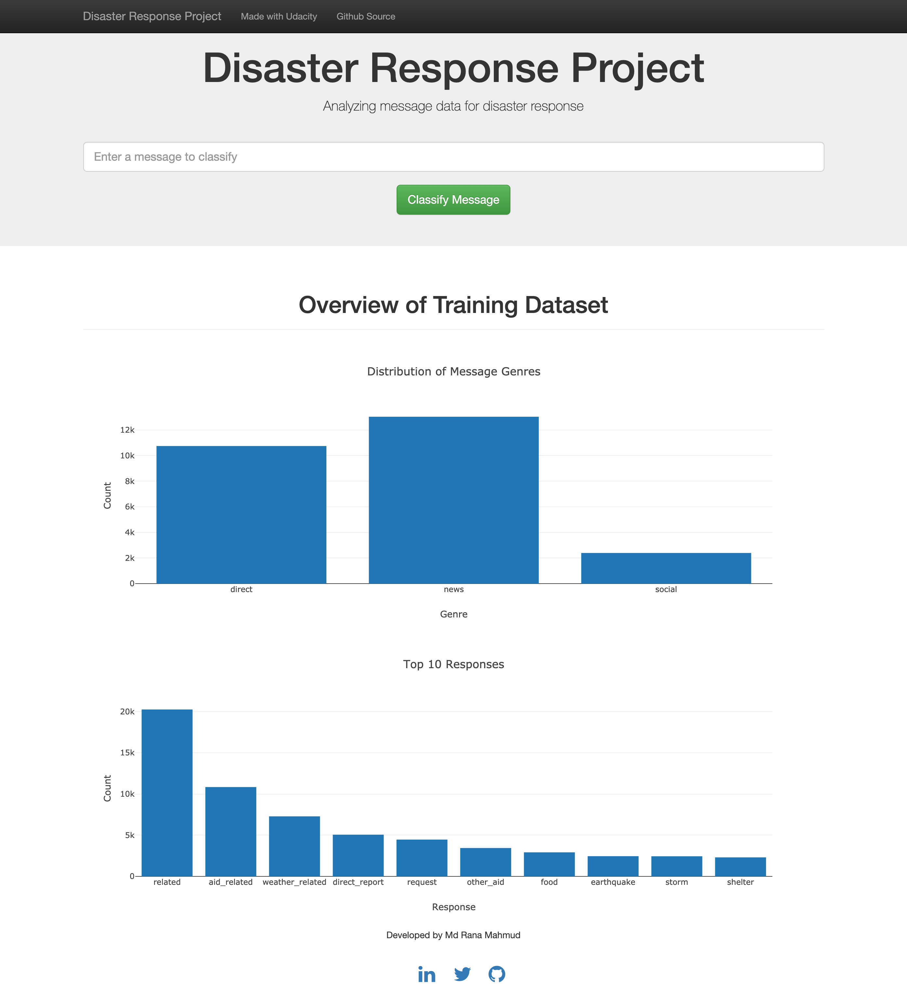
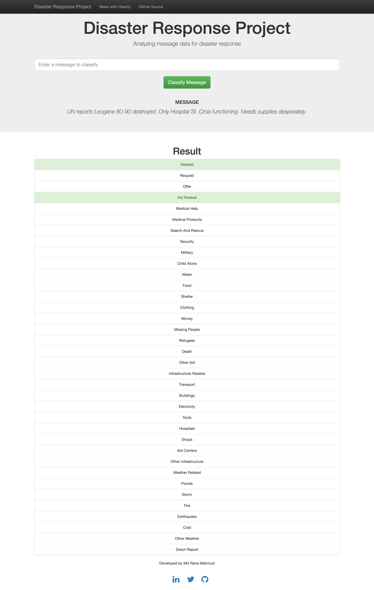
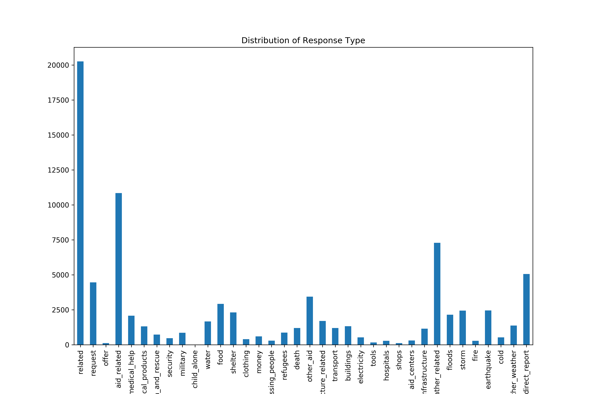

# Disaster Response Pipeline Project

### Instructions:
1. Run the following commands in the project's root directory to set up your database and model.

    - To run ETL pipeline that cleans data and stores in database
        `python data/process_data.py data/disaster_messages.csv data/disaster_categories.csv data/DisasterResponse.db`
    - To run ML pipeline that trains classifier and saves
        `python models/train_classifier.py data/DisasterResponse.db models/classifier.pkl`

2. Run the following command in the app's directory to run your web app.
    `python run.py`

3. Go to http://0.0.0.0:3001/

•	Go into more detail about the dataset and your data cleaning and modeling process in your README file, add screenshots of your web app and model results.

### Dataset
This disaster data is from [Figure Eight](https://www.figure-eight.com/)
This dataset has two files messages.csv and categories.csv.
### Data Cleaning

1. Based on id two datasets were first merged into df.
2. Categories were splitted into separate category columns.
3. Category values were converted to numbers 0 or 1.
4. Replaced categories column in df with new category columns.
5. Removed duplicates based on message column.

### Modeling Process

### Screenshots

### model results

•	This dataset is imbalanced (ie some labels like water have few examples). In your README, discuss how this imbalance, how that affects training the model, and your thoughts about emphasizing precision or recall for the various categories.

### Effect of Imbalance:
The dataset is imbalance. We can get an idea of imbalance from the following image.

For imbalanced classes with fewer samples the model will not generalize well. For various categories we should focus on recall as all the categories has same precision.
